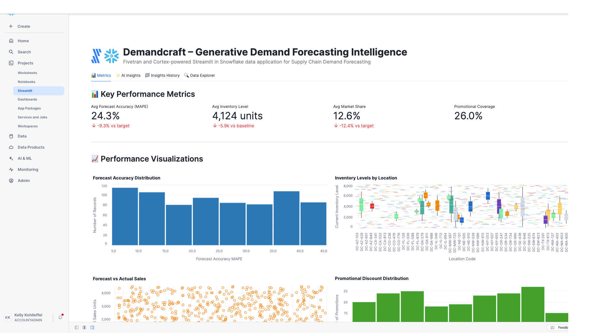

# DemandCraft – AI-Powered Demand Forecasting and Supply Chain Optimization

A Fivetran and Cortex-powered Streamlit in Snowflake data application for Supply Chain Demand Forecasting with advanced AI Agent Workflows.

## Overview

DemandCraft is an AI-powered demand forecasting and supply chain optimization system that helps companies automate the manual and time-consuming process of analyzing demand planning data, inventory levels, and forecasting performance metrics. This Streamlit in Snowflake data application helps VP of Demand Planning, Chief Supply Chain Officers, and Sales Operations Directors improve forecast accuracy, reduce excess inventory, minimize stockout incidents, and accelerate demand planning through real-time analysis of supply chain data.

The application features sophisticated AI Agent Workflows that provide transparent, step-by-step analysis of demand forecasting data, transforming complex forecast models and inventory optimization strategies into actionable supply chain insights and adaptive demand planning recommendations. Each analysis focus area operates through specialized mini-agents that simulate the decision-making process of experienced demand planners and supply chain optimization experts.

The application utilizes a synthetic supply chain dataset that simulates data from demand planning systems, point of sale platforms, and market intelligence databases. This synthetic data is moved into Snowflake using a custom connector built with the Fivetran Connector SDK, enabling reliable and efficient data pipelines for supply chain demand forecasting analytics.

## AI Agent Workflows

### Agent Architecture Overview

DemandCraft employs a sophisticated multi-agent architecture designed specifically for supply chain demand forecasting analysis. Each focus area operates through specialized AI agents that break down complex demand planning and inventory optimization tasks into transparent, sequential steps that mirror the thought processes of experienced demand planners and supply chain optimization professionals.

### Focus Area Agents

#### Overall Performance Agent
**Business Challenge**: VP of Demand Planning and Chief Supply Chain Officers manually review hundreds of demand forecasts, inventory levels, and sales performance metrics daily, spending 4+ hours analyzing forecast accuracy, promotional impacts, and seasonal variations to identify critical supply chain inefficiencies and demand planning optimization opportunities.

**Agent Solution**: Autonomous demand forecasting workflow that analyzes forecast data, inventory metrics, sales performance, and market intelligence to generate automated demand summaries, identify forecasting bottlenecks, and produce prioritized supply chain insights with adaptive demand planning recommendations.

**Agent Workflow Steps**:
1. **Demand Forecasting Data Initialization** - Loading comprehensive demand planning dataset with enhanced validation across forecast records and product SKUs
2. **Forecast Accuracy Assessment** - Advanced calculation of demand planning indicators with forecast analysis
3. **Demand Planning Pattern Recognition** - Sophisticated identification of demand patterns with promotional correlation analysis
4. **AI Demand Planning Intelligence Processing** - Processing comprehensive supply chain data through selected AI model with advanced reasoning
5. **Supply Chain Performance Report Compilation** - Professional demand planning analysis with evidence-based recommendations and actionable forecasting insights

#### Optimization Opportunities Agent
**Business Challenge**: Sales Operations Directors spend 5+ hours daily manually identifying inefficiencies in demand planning strategies, inventory optimization criteria, and promotional impact modeling across multiple product categories and geographic locations.

**Agent Solution**: AI-powered demand planning optimization analysis that automatically detects forecast accuracy gaps, inventory management inefficiencies, and promotional strategy improvements with specific implementation recommendations for Oracle Demantra, SAP IBP, and Kinaxis RapidResponse system integration.

**Agent Workflow Steps**:
1. **Demand Planning Optimization Data Preparation** - Advanced loading of demand forecasting data with enhanced validation for forecasting improvement identification
2. **Forecast Accuracy Inefficiency Detection** - Sophisticated analysis of demand planning strategies and inventory performance with evidence-based inefficiency identification
3. **Supply Chain Correlation Analysis** - Enhanced examination of relationships between product categories, promotional activities, and forecast accuracy rates
4. **ERP Integration Optimization** - Comprehensive evaluation of demand planning integration with existing Oracle Demantra, SAP IBP, and Kinaxis RapidResponse systems
5. **AI Demand Planning Intelligence** - Generating advanced supply chain optimization recommendations using selected AI model with demand planning reasoning
6. **Demand Planning Strategy Finalization** - Professional supply chain optimization report with prioritized implementation roadmap and inventory impact analysis

#### Financial Impact Agent
**Business Challenge**: Chief Revenue Officers manually calculate complex ROI metrics across demand planning activities and inventory management performance, requiring 4+ hours of cost modeling to assess supply chain efficiency and inventory optimization across the product portfolio.

**Agent Solution**: Automated supply chain financial analysis that calculates comprehensive demand planning ROI, identifies inventory carrying cost reduction opportunities across product categories, and projects forecast accuracy benefits with detailed supply chain cost forecasting.

**Agent Workflow Steps**:
1. **Supply Chain Financial Data Integration** - Advanced loading of demand planning financial data and inventory cost metrics with enhanced validation across forecast records
2. **Demand Planning Cost-Benefit Calculation** - Sophisticated ROI metrics calculation with inventory analysis and demand planning efficiency cost savings
3. **Inventory Management Impact Assessment** - Enhanced analysis of supply chain revenue impact with inventory turnover metrics and demand correlation analysis
4. **Demand Planning Resource Efficiency Analysis** - Comprehensive evaluation of resource allocation efficiency across demand planning activities with forecast lifecycle cost optimization
5. **AI Supply Chain Financial Modeling** - Advanced demand planning financial projections and supply chain ROI calculations using selected AI model
6. **Supply Chain Economics Report Generation** - Professional supply chain financial impact analysis with detailed demand planning ROI calculations and inventory cost forecasting

#### Strategic Recommendations Agent
**Business Challenge**: Chief Supply Chain Officers spend hours manually analyzing digital transformation opportunities and developing strategic demand planning technology roadmaps for forecasting advancement and adaptive planning implementation across product portfolios.

**Agent Solution**: Strategic demand planning intelligence workflow that analyzes competitive advantages against traditional statistical forecasting processes, identifies AI and adaptive forecasting integration opportunities, and creates prioritized digital supply chain transformation roadmaps.

**Agent Workflow Steps**:
1. **Supply Chain Technology Assessment** - Advanced loading of demand planning digital context with competitive positioning analysis across forecast records and product SKUs
2. **Demand Planning Competitive Advantage Analysis** - Sophisticated evaluation of competitive positioning against traditional statistical forecasting with AI-powered demand optimization effectiveness
3. **Advanced Supply Chain Technology Integration** - Enhanced analysis of integration opportunities with IoT sensors, real-time POS data, and AI-powered demand sensing across supply chain data dimensions
4. **Digital Supply Chain Strategy Development** - Comprehensive development of prioritized digital transformation roadmap with evidence-based supply chain technology adoption strategies
5. **AI Supply Chain Strategic Processing** - Advanced demand planning strategic recommendations using selected AI model with long-term competitive positioning
6. **Digital Demand Planning Report Generation** - Professional digital supply chain transformation roadmap with competitive analysis and demand planning technology implementation plan ready for CRO executive review

### Agent Execution Flow

1. **Agent Initialization** - User selects focus area and AI model, triggering specialized agent activation
2. **Data Context Loading** - Agent accesses demand forecasts, inventory levels, and sales performance metrics
3. **Step-by-Step Processing** - Agent executes sequential workflow steps with real-time progress visualization
4. **Supply Chain Intelligence Integration** - Selected Snowflake Cortex model processes demand planning context with specialized prompting
5. **Results Compilation** - Agent generates comprehensive demand forecasting analysis with actionable supply chain recommendations
6. **Report Delivery** - Professional supply chain report delivered with implementation roadmap and success metrics

## Data Sources

The application is designed to work with data from major supply chain demand planning systems:

### Supply Chain Data Sources (Simulated)
- **Demand Planning Systems**: 
  - Oracle Demantra
  - SAP Integrated Business Planning (IBP)
  - Kinaxis RapidResponse
- **Point of Sale (POS) Platforms**: 
  - NCR
  - Diebold Nixdorf
  - Toshiba Commerce Solutions
- **Customer Relationship Management (CRM)**: 
  - Salesforce
  - Microsoft Dynamics CRM
  - HubSpot
- **Market Intelligence**:
  - Nielsen
  - IRI
  - Euromonitor International
- **Economic Data**:
  - Federal Reserve Economic Data (FRED)
  - Bloomberg Terminal
  - Refinitiv Eikon
- **Supply Chain Management**:
  - Oracle SCM Cloud
  - SAP S/4HANA
  - Manhattan Associates

For demonstration and development purposes, we've created a synthetic dataset that approximates these data sources and combined them into a single table exposed through an API server. This approach allows for realistic supply chain demand forecasting analytics without using proprietary business data.

## Key Features

- **AI Agent Workflows**: Transparent, step-by-step demand forecasting analysis through specialized mini-agents for each focus area
- **Agent Progress Visualization**: Real-time display of agent processing steps with supply chain context and completion tracking
- **Focus Area Specialization**: Dedicated agents for Overall Performance, Optimization Opportunities, Financial Impact, and Strategic Recommendations
- **Supply Chain Intelligence Integration**: Seamless integration with multiple Snowflake Cortex models for specialized demand planning analysis
- **AI-powered demand forecasting optimization**: Leverages generative AI to analyze demand patterns and automatically generate optimized forecasting models with key insights
- **Integration with synthetic supply chain data**: Simulates data from major demand planning systems, POS platforms, and market intelligence providers
- **Comprehensive data application**: Visual representation of key metrics including forecast accuracy, inventory levels, stockout rates, and promotional impacts
- **Custom Fivetran connector**: Utilizes a custom connector built with the Fivetran Connector SDK to reliably move data from the API server to Snowflake

## Streamlit Data App Sections

### Metrics
- **Key Performance Indicators**: Track forecast accuracy (MAPE), inventory levels, market share, and promotional coverage
- **Supply Chain Analytics**: Monitor product SKUs, locations, and demand planning efficiency
- **Forecast Accuracy Distribution**: Visualize forecast accuracy patterns across demand planning activities
- **Inventory Analysis**: Analyze inventory levels by location with boxplot visualizations
- **Promotional Impact**: Track promotional discount distribution and effectiveness
- **Market Share Trends**: Review market share distribution across product categories
- **Stockout Analysis**: Monitor stockout rates by location to identify high-risk areas
- **Economic Indicators**: Assess economic indicators vs forecast accuracy relationships

### AI Insights with Agent Workflows
Generate AI-powered insights through transparent agent workflows with different focus areas:
- **Overall Performance**: Comprehensive analysis of the demand forecasting and supply chain optimization system through autonomous demand planning workflow
- **Optimization Opportunities**: Areas where forecast accuracy and inventory efficiency can be improved via AI-powered demand planning optimization analysis
- **Financial Impact**: Cost-benefit analysis and ROI in supply chain terms through automated supply chain financial analysis
- **Strategic Recommendations**: Long-term strategic implications for digital transformation via strategic demand planning intelligence workflow

Each focus area includes:
- **Business Challenge Description**: Detailed explanation of the specific supply chain problem being addressed
- **Agent Solution Overview**: Description of how the AI agent workflow solves the demand planning challenge
- **Real-time Progress Tracking**: Step-by-step visualization of agent processing with supply chain context
- **Agent Execution Controls**: Start/stop controls for managing agent workflow execution
- **Professional Supply Chain Reports**: Comprehensive analysis reports with implementation roadmaps

### Insights History
Access previously generated agent-driven insights for reference and comparison, including agent execution details and model selection.

### Data Explorer
Explore the underlying supply chain demand forecasting data with pagination controls.

## Setup Instructions

1. Within Snowflake, click on **Projects**
2. Click on **Streamlit**
3. Click the blue box in the upper right to create a new Streamlit application
4. On the next page:
   - Name your application
   - **IMPORTANT:** Set the database context
   - **IMPORTANT:** Set the schema context

### Fivetran Data Movement Setup

1. Ensure the API server hosting the synthetic supply chain data is operational
2. Configure the custom Fivetran connector (built with Fivetran Connector SDK) to connect to the API server - debug and deploy
3. Start the Fivetran sync in the Fivetran UI to move data into a `SPL_RECORDS` table in your Snowflake instance
4. Verify data is being loaded correctly by checking the table in Snowflake

## Data Flow

1. **Synthetic Data Creation**: A synthetic dataset approximating real supply chain demand planning data sources has been created and exposed via an API server:
   - Demand Planning Systems: Oracle Demantra, SAP IBP, Kinaxis RapidResponse
   - Point of Sale Platforms: NCR, Diebold Nixdorf, Toshiba Commerce Solutions
   - Market Intelligence: Nielsen, IRI, Euromonitor International

2. **Custom Data Integration**: A custom connector built with the Fivetran Connector SDK communicates with the API server to extract the synthetic supply chain data

3. **Automated Data Movement**: Fivetran manages the orchestration and scheduling of data movement from the API server into Snowflake

4. **Data Loading**: The synthetic supply chain data is loaded into Snowflake as a `SPL_RECORDS` table in a structured format ready for analysis

5. **Agent Workflow Execution**: AI agents process the demand forecasting data through specialized workflows, providing transparent step-by-step analysis

6. **Data Analysis**: Snowpark for Python and Snowflake Cortex analyze the data to generate insights through agent-driven processes

7. **Data Visualization**: Streamlit in Snowflake presents the analyzed data in an interactive data application with agent workflow visualization

## Data Requirements

The application expects a table named `SPL_RECORDS` which contains synthetic data simulating various supply chain demand planning systems. This data is retrieved from an API server using a custom Fivetran connector built with the Fivetran Connector SDK:

### Demand Forecasting Data
- `record_id`
- `forecast_date`
- `product_sku`
- `location_code`
- `forecast_horizon_days`
- `baseline_demand_forecast`
- `adjusted_demand_forecast`
- `actual_sales_units`
- `pos_transaction_count`
- `current_inventory_level`
- `stockout_indicator`
- `promotional_activity_flag`
- `promotion_discount_percent`

### Market Intelligence Metrics
- `market_share_percent`
- `category_growth_rate`
- `competitor_price_index`
- `economic_indicator_gdp`
- `consumer_confidence_index`
- `seasonal_index`
- `forecast_accuracy_mape`
- `sales_rep_adjustment`

## Benefits

- **4.8 million units of excess inventory reduction annually**: 40 million units average inventory × 15% excess rate × 80% reduction = 4.8 million units reduced/year
- **$14.4 million in inventory carrying cost savings annually**: $120 million inventory value × 15% carrying cost rate × 80% excess reduction = $14.4 million savings/year
- **960 fewer stockout incidents per year**: 4,800 annual stockout events × 20% reduction = 960 fewer stockouts/year
- **$9.6 million in additional revenue from improved availability**: 960 prevented stockouts × $10,000 average lost revenue per stockout = $9.6 million additional revenue/year
- **Enhanced Supply Chain Transparency**: Agent workflows provide clear visibility into demand forecasting analysis reasoning and decision-making processes
- **Accelerated Planning Insights**: Automated agent processing reduces manual analysis time from hours to minutes for complex forecasting assessments

## Technical Details

This application uses:
- **AI Agent Workflow Engine**: Custom agent orchestration system for transparent, step-by-step demand forecasting analysis
- **Multi-Agent Architecture**: Specialized agents for different supply chain focus areas with domain-specific processing
- **Agent Progress Visualization**: Real-time display of agent execution steps with demand planning context and completion tracking
- **Streamlit in Snowflake** for the user interface with enhanced agent workflow displays
- **Snowflake Cortex** for AI-powered insights generation through agent-managed prompting
- **Multiple AI models** including OpenAI GPT, Claude 4 Sonnet, Claude 3.5 Sonnet, Llama 3.1/3.3, Mistral, DeepSeek, and more for agent intelligence
- **Snowpark for Python** for data processing within agent workflows
- **Fivetran Connector SDK** for building a custom connector to retrieve synthetic supply chain data from an API server
- **Custom Fivetran connector** for automated, reliable data movement into Snowflake

## Success Metrics

- Forecast accuracy improvement (MAPE reduction)
- Inventory turnover ratio enhancement
- Stockout incident frequency reduction
- Promotional ROI optimization
- Supply chain cost reduction
- **Agent Workflow Efficiency**: Time reduction from manual demand planning analysis to automated agent-driven insights
- **Supply Chain Transparency Score**: User confidence in forecasting recommendations through visible agent reasoning
- **Demand Planning Accuracy**: Improvement in forecast success rates through systematic agent processing

## Key Stakeholders

- VP of Demand Planning
- Chief Supply Chain Officer (CSO)
- Chief Revenue Officer (CRO)
- Sales Operations Directors
- Category Managers
- Inventory Planners
- Marketing Analytics Teams
- Supply Chain Analysts
- Demand Planning Managers
- **Supply Chain Operations Analysts**: Professionals who benefit from transparent agent workflow visibility
- **Forecasting Teams**: Staff who implement agent-recommended demand planning strategies

## Competitive Advantage

DemandCraft differentiates itself by leveraging generative AI with transparent agent workflows to automate the demand forecasting process, reducing manual labor and increasing the speed of insights. The agent-based architecture provides unprecedented visibility into supply chain analysis reasoning, building trust and confidence in AI-driven forecasting decisions. This creates a competitive advantage by enabling faster decision-making and improved forecast accuracy in supply chain operations while maintaining complete transparency in the analysis process.

## Long-term Evolution

In the next 3-5 years, DemandCraft will evolve to incorporate more advanced generative AI techniques and sophisticated agent architectures, including:

- **Multi-modal Agent Learning**: Agents that can process POS data, market intelligence reports, and economic indicators from diverse supply chain systems
- **Collaborative Agent Networks**: Multiple agents working together to solve complex demand forecasting challenges across different product categories
- **Adaptive Agent Intelligence**: Self-improving agents that learn from forecast outcomes and refine their analytical approaches
- **Advanced Agent Orchestration**: Sophisticated workflow management for complex, multi-step demand planning analysis processes
- **Integration with Emerging Supply Chain Technologies**: Agent connectivity with IoT sensors, real-time POS systems, and autonomous supply chain platforms for comprehensive demand intelligence

The system will expand to include integration with emerging technologies like IoT sensors and real-time market data platforms, all orchestrated through advanced agent workflows that provide complete transparency and control over the demand forecasting analysis process.