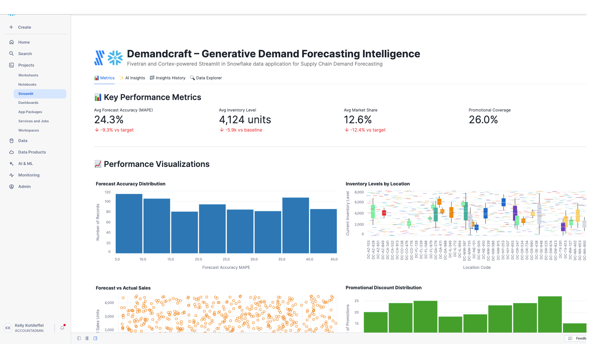

# DemandCraft – AI-Powered Demand Forecasting Intelligence

A Fivetran and Cortex-powered Streamlit in Snowflake data application for Supply Chain Demand Forecasting.

## Overview

DemandCraft is an AI-powered demand forecasting intelligence system that helps supply chain companies automate the complex and time-consuming process of creating accurate demand predictions across multiple time horizons. This Streamlit in Snowflake data application helps Chief Revenue Officers, VP of Demand Planning, and supply chain directors reduce excess inventory, minimize stockouts, optimize promotional campaigns, and improve forecast accuracy through real-time analysis of demand planning, sales, and market intelligence data.

The application utilizes a synthetic supply chain dataset that simulates data from demand planning systems, point-of-sale terminals, customer relationship management platforms, and market intelligence databases. This synthetic data is moved into Snowflake using a custom connector built with the Fivetran Connector SDK, enabling reliable and efficient data pipelines for supply chain demand forecasting analytics.

## Data Sources

The application is designed to work with data from major supply chain and demand planning systems:

### Supply Chain Data Sources (Simulated)
- **Demand Planning Systems**: 
  - Oracle Demantra
  - SAP Integrated Business Planning
  - Kinaxis RapidResponse
- **Point of Sale (POS) Systems**: 
  - NCR
  - Diebold Nixdorf
  - Toshiba Commerce Solutions
- **Customer Relationship Management (CRM)**: 
  - Salesforce
  - Microsoft Dynamics CRM
  - HubSpot
- **Market Intelligence Platforms**: 
  - Nielsen
  - IRI
  - Euromonitor International
- **Economic Data Sources**: 
  - Federal Reserve Economic Data (FRED)
  - Bloomberg Terminal
  - Refinitiv Eikon

For demonstration and development purposes, we've created a synthetic dataset that approximates these data sources and combined them into a single table exposed through an API server. This approach allows for realistic supply chain demand forecasting analytics without using proprietary demand planning data.

## Key Features

- **AI-powered multi-horizon demand forecasting**: Leverages generative AI to analyze demand patterns and automatically generate optimized forecasts from daily to annual timeframes
- **Integration with synthetic supply chain data**: Simulates data from major demand planning platforms, POS systems, and market intelligence sources
- **Comprehensive demand forecasting analytics**: Visual representation of key metrics including forecast accuracy, inventory levels, stockout rates, and promotional impact analysis
- **AI-powered insights**: Generate in-depth analysis of overall performance, optimization opportunities, financial impact, and strategic recommendations
- **Custom Fivetran connector**: Utilizes a custom connector built with the Fivetran Connector SDK to reliably move data from the API server to Snowflake

## Streamlit Data App Sections

### 📊 Metrics
- **Key Performance Indicators**: Track forecast accuracy (MAPE), inventory levels, stockout rates, and promotional coverage
- **Demand Forecasting Analytics**: Monitor forecast vs actual performance, inventory distribution, and promotional impact
- **Forecast Accuracy Analysis**: Visualize MAPE distribution across products and locations
- **Inventory Management**: Analyze inventory levels by location with boxplot visualizations
- **Promotional Impact**: Track promotional discount distribution and effectiveness over time
- **Market Performance**: Review market share by product category to identify growth opportunities
- **Stockout Analysis**: Monitor stockout rates by location to identify supply chain vulnerabilities
- **Economic Correlation**: Analyze correlation between economic indicators and forecast accuracy

### ✨ AI Insights
Generate AI-powered insights with different focus areas:
- **Overall Performance**: Comprehensive analysis of the demand forecasting and supply chain optimization system
- **Optimization Opportunities**: Areas where forecast accuracy, inventory management, and promotional planning can be improved
- **Financial Impact**: Cost-benefit analysis and ROI in supply chain terms (inventory carrying costs vs. forecast improvements)
- **Strategic Recommendations**: Long-term strategic implications for digital transformation in supply chain demand planning

### 📁 Insights History
Access previously generated insights for reference and comparison.

### 🔍 Data Explorer
Explore the underlying supply chain demand forecasting data with pagination controls.

## Setup Instructions

1. Within Snowflake, click on **Projects**
2. Click on **Streamlit**
3. Click the blue box in the upper right to create a new Streamlit application
4. On the next page:
   - Name your application
   - **IMPORTANT:** Set the database context
   - **IMPORTANT:** Set the schema context

### Fivetran Data Movement Setup

1. Ensure the API server hosting the synthetic supply chain data is operational
2. Configure the custom Fivetran connector (built with Fivetran Connector SDK) to connect to the API server - debug and deploy
3. Start the Fivetran sync in the Fivetran UI to move data into a `SPL_RECORDS` table in your Snowflake instance
4. Verify data is being loaded correctly by checking the table in Snowflake

## Data Flow

1. **Synthetic Data Creation**: A synthetic dataset approximating real supply chain demand forecasting data sources has been created and exposed via an API server:
   - Demand Planning Systems: Oracle Demantra, SAP Integrated Business Planning, Kinaxis RapidResponse
   - Point of Sale Systems: NCR, Diebold Nixdorf, Toshiba Commerce Solutions
   - Market Intelligence: Nielsen, IRI, Euromonitor International

2. **Custom Data Integration**: A custom connector built with the Fivetran Connector SDK communicates with the API server to extract the synthetic supply chain demand forecasting data

3. **Automated Data Movement**: Fivetran manages the orchestration and scheduling of data movement from the API server into Snowflake

4. **Data Loading**: The synthetic supply chain data is loaded into Snowflake as a `SPL_RECORDS` table in a structured format ready for analysis

5. **Data Analysis**: Snowpark for Python and Snowflake Cortex analyze the data to generate insights

6. **Data Visualization**: Streamlit in Snowflake presents the analyzed data in an interactive data application

## Data Requirements

The application expects a table named `SPL_RECORDS` which contains synthetic data simulating various supply chain demand forecasting systems. This data is retrieved from an API server using a custom Fivetran connector built with the Fivetran Connector SDK:

### Demand Forecasting Identifiers
- `RECORD_ID`
- `PRODUCT_SKU`
- `LOCATION_CODE`

### Forecast Information
- `FORECAST_DATE`
- `FORECAST_HORIZON_DAYS`
- `BASELINE_DEMAND_FORECAST`
- `ADJUSTED_DEMAND_FORECAST`
- `ACTUAL_SALES_UNITS`

### Inventory and Sales Data
- `CURRENT_INVENTORY_LEVEL`
- `POS_TRANSACTION_COUNT`
- `STOCKOUT_INDICATOR`

### Promotional and Market Data
- `PROMOTIONAL_ACTIVITY_FLAG`
- `PROMOTION_DISCOUNT_PERCENT`
- `MARKET_SHARE_PERCENT`
- `CATEGORY_GROWTH_RATE`
- `COMPETITOR_PRICE_INDEX`

### Economic and External Factors
- `ECONOMIC_INDICATOR_GDP`
- `CONSUMER_CONFIDENCE_INDEX`
- `SEASONAL_INDEX`

### Performance Metrics
- `FORECAST_ACCURACY_MAPE` (Float)
- `SALES_REP_ADJUSTMENT`

## Benefits

- **4,800,000 units of excess inventory reduction annually**: 40,000,000 units average inventory × 15% excess rate × 80% reduction = 4,800,000 units reduced/year
- **$14,400,000 in inventory carrying cost savings annually**: $120,000,000 inventory value × 15% carrying cost rate × 80% excess reduction = $14,400,000 savings/year
- **960 fewer stockout incidents per year**: 4,800 annual stockout events × 20% reduction = 960 fewer stockouts/year
- **$9,600,000 in additional revenue from improved availability**: 960 prevented stockouts × $10,000 average lost revenue per stockout = $9,600,000 additional revenue/year

## Technical Details

This application uses:
- Streamlit in Snowflake for the user interface
- Snowflake Cortex for AI-powered insights generation
- Multiple AI models including Claude 4 Sonnet, Claude 3.5 Sonnet, Llama 3.1/3.3, Mistral, DeepSeek, and more
- Snowpark for Python for data processing
- **Fivetran Connector SDK** for building a custom connector to retrieve synthetic supply chain demand forecasting data from an API server
- **Custom Fivetran connector** for automated, reliable data movement into Snowflake

## Success Metrics

- Forecast accuracy improvement (Mean Absolute Percentage Error reduction)
- Inventory turnover ratio enhancement
- Stockout frequency reduction
- Promotional campaign ROI improvement
- Supply chain cost optimization

## Key Stakeholders

- Primary: VP of Demand Planning, Chief Supply Chain Officer, Sales Operations Directors
- Secondary: Category Managers, Inventory Planners, Marketing Analytics Teams
- Tertiary: Sales Representatives, Supply Chain Analysts, Procurement Specialists
- **Top C-Level Executive:** Chief Revenue Officer (CRO)

## Competitive Advantage

DemandCraft differentiates from traditional demand forecasting through its generative AI capability to create synthetic demand scenarios and test forecasting models against thousands of simulated market conditions. Unlike conventional statistical forecasting tools, it generates human-readable explanations for forecast changes and automatically adapts to new market patterns without manual model retraining. This proactive approach reduces excess inventory by 80% and stockouts by 20% compared to traditional forecasting methods.

## Long-term Evolution

Over the next 3-5 years, DemandCraft will continue to evolve by incorporating real-time IoT sensor data, expanding to include dynamic pricing optimization, and integrating with emerging supply chain technologies like autonomous inventory management and predictive logistics planning.